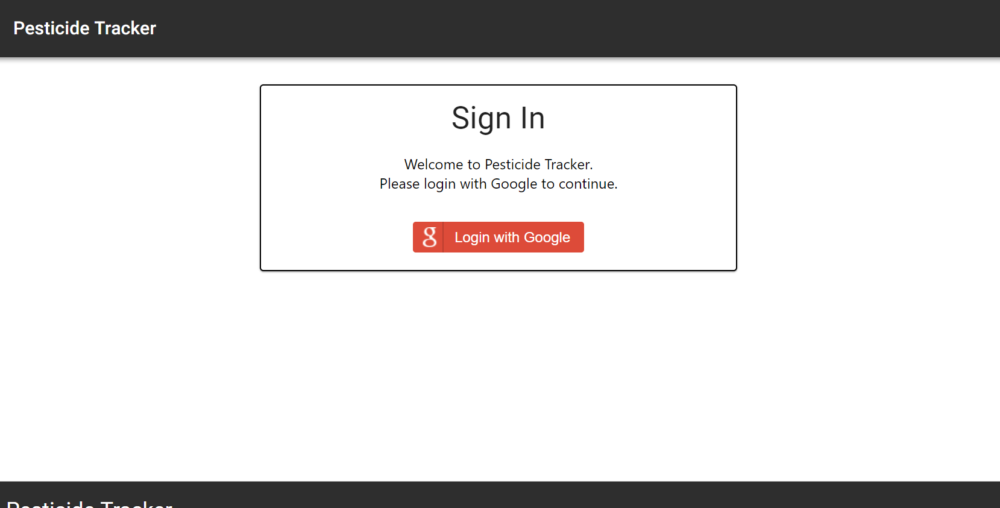
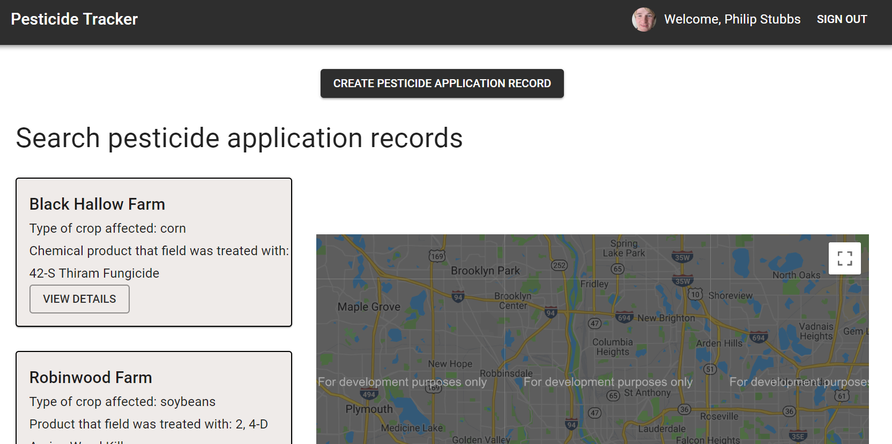
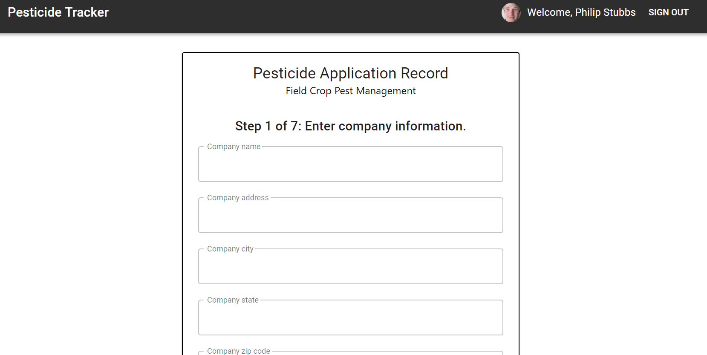
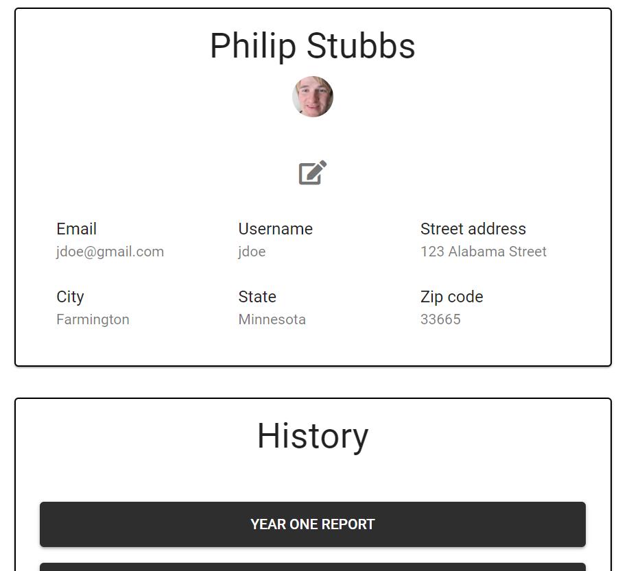

# Pesticide Tracker

## Table Number and Project Team

Table Number: 26

Team:

* Natalia Aulia (Developer)
* Billy Halim (Developer)
* Phil Stubbs (Developer)

NOTE: If you plan on downloading and running this codebase locally on your computer, please use npm (not yarn) due to this [issue](https://github.com/facebook/create-react-app/issues/6334) found yesterday against React. Facebook documented a workaround within the issue, but the workaround only works for npm (and not yarn).

## Table of contents

* [Live](#live)
* [Getting started](#getting-started)
* [Screenshots](#screenshots)
* [About this project](#about-this-project)
  * [How the app is built](#how-the-app-is-built)
  * [App workflow](#workflow)
  * [Structure of the project](#project-structure)
* [Technologies used to create the app](#technologies-used)
* [Direction for future development](#future)
* [Deploying the app](#deployment)
* [Issues](#Issues)

## <a name="live"></a>Live

The app is currently live at the following URL: 

<https://pesticidetracker.firebaseapp.com/>

## <a name="getting-started"></a> Getting started

The following section will take you through the steps of setting up this app and getting it running locally on your computer.

If you don't want to set up this project locally and just want to see the deployed app, go to <https://pesticidetracker.firebaseapp.com/>.

To set up this app locally on your computer, perform the following steps:

  1. [Clone the repository from GitHub](#clone-repository)
  2. [Install Node.js](#install-node)
  3. [Install the project dependencies](#dependencies)
  4. [Start the React development server](#start-server)

###  <a name="clone-repository"></a> 1. Clone the repository from GitHub
The first step is to clone the repository from GitHub to a local directory on your computer. To clone the repository, run the following commands:

```bash
git clone https://github.com/philipstubbs13/pesticide-tracker.git
cd ./pesticide-tracker
```

If you don't have git, you will need git, which you can download [here](https://git-scm.com/downloads).

###  <a name="install-node"></a> 2. Install Node.js

If you don't already have Node.js installed on your computer, you can install the latest version [here](https://nodejs.org/en/).

Troubleshooting tip: If you have difficulty starting the app locally, I used node v8.11.3 when testing these instructions.

### <a name="dependencies"></a> 3. Install the project dependencies

Change directory into the <b>client</b> directory and run the following command to install the required dependencies:

```bash
npm install
```

The following packages are dependencies to the project.

* [@material-ui/core](https://www.npmjs.com/package/@material-ui/core)
  * This is a third party design library of React components that implement Google's Material Design.
* [@material-ui/icons](https://www.npmjs.com/package/@material-ui/icons)
  * This is a library of Material Design icons.
* [prop-types](https://www.npmjs.com/package/prop-types)
  * This is used to document and validate the different properties passed to a component.
* [react](https://www.npmjs.com/package/react)
  * This package contains the functionality necessary to define React components.
* [react-dom](https://www.npmjs.com/package/react-dom)
  * This serves as the entry point of the DOM-related rendering paths
* [react-router-dom](https://www.npmjs.com/package/react-router-dom)
  * This is a third party routing library use to connect and link different components across the app.
* [react-scripts](https://www.npmjs.com/package/react-scripts)
  * This includes scripts and configuration used by Create React App.
* [firebase](https://github.com/leoasis/react-sound)
  * Firebase provides the infastructure for a real time database within the application as well a platform for deploying and hosting.
* [google-map-react](https://github.com/google-map-react/google-map-react)
  * This package is used to generate a Google map and markers to mark pesticide application locations within the application.

This project also uses ESLint and the Airbnb JavaScript style guide to help maintain code quality. ESLint includes the following dev dependencies:

* babel-eslint
* eslint
* eslint-config-airbnb
* eslint-plugin-import
* eslint-plugin-jsx-a11y
* eslint-plugin-react

For more information on the Airbnb style guide, go [here](https://github.com/airbnb/javascript).

Version information for each of these packages is available in the <b>package.json</b> file in the project root directory.

###  <a name="start-server"></a> 5. Start the React development server.

After performing all of the setup steps in the <b>Getting started</b> section, navigate to the <b>client</b> and run the following command to start the React development server:

```bash
npm start
```

After the development server has started, a browser window should open, and you should see the app. If the browser does not automatically open after the server starts, you can verify that the app is working locally on your computer by opening the browser and going to [http://localhost:3000](http://localhost:3000). Note that by default, the development server will try to start up on port 3000. If port 3000 is already in use on your computer, then you might be asked if you want to use a different port.

## <a name="screenshots"></a> Screenshots

### Sign In page



### Landing page



### Pesticide Application Record form



### Profile and History page



## <a name="about-this-project"></a> About this project

### <a name="how-the-app-is-built"></a> How the app is built

This project is built using [React](https://reactjs.org/), which is an open source JavaScript library developed at Facebook specifically for the task of developing user interfaces. React relies on a component-based architecture where elements of the user interface are broken into small chunks of code called components. To design and build the user interface, I used the [Material UI](https://material-ui.com/) library, which is a 3rd party UI library of React components that mimic Google's [Material Design specification](https://material.io/). I used Material UI for styling, theming, and incorporating cool components. As to the grid/layout system I used, I went with Flexbox, making it easy to design for smaller screens.

This project also uses Google's Firebase Real Time Database to store data from a pestacide dataset from the U.S. Environment Protection Agency (EPA). The dataset includes information about different chemical products used to treat fields across the U.S and outside the U.S. However, for this project, we limited the scope to only Minnesota.

### <a name="workflow"></a> App workflow

#### Authentication

#### Landing Page

#### Profile and History Page

#### Create Pesticide Application Record Form/Template

#### Log out

### <a name="project-structure"></a> Structure of the project

After you clone the repository from GitHub, you can navigate to the <b>client</b> directory. The project directory structure will be set up as follows:

* <b>public</b>: The public folder contains the main index.html file. This HTML file contains a div with an id of root, which is the entry point to the app. This site uses a React component-based architecture to create, build, and render UI components.
* <b>src</b>: The src folder is where the React components reside.
  * <b>App.js</b>: The App.js file is where the components are imported and rendered, such as the top navigation bar, footer, and various page routes.
  * <b>index.js</b>: The index.js file is the top level file of the React app. In index.js, the App.js file is imported, and the ReactDOM.render method is used to render App.js.
  * <b>components</b>: The components folder is where the components that are reused across the app are located. Each file represents a separate component. For example, NavBar is the top navigation bar component that can be reused across the entire app for a consistent look and feel on each page. Each component also has their own, separate css.
  * <b>containers</b>: This folder holds all the pages of the app. For example, inside of the containers folder, there is a ReportForm folder. The ReportForm folder contains a top-level parent container/page for the create pesticide application record page called ReportForm.js.
  * <b>App.css</b> and <b>index.css</b>: The external css stylesheets for the app.
* <b>.eslintrc.json</b>: List of rules and their definitions for ESLint. This project uses the Airbnb JavaScript style guide for designing consistent, clean code.
* <b>.firebaserc</b>: Hidden file that allows you to quickly switch between projects with 'firebase use'.
* <b>.gitignore</b>: Anything listed inside this file (for example, node_modules) will not be tracked by GitHub when code is committed and pushed.
* <b>firebase.json</b>: Firebase configuration file required to deploy the app to Firebase.
* <b>package.json</b>: Lists the project dependencies and their version numbers.
* <b>package-lock.json</b>: Dependency tree for the project. Lists all the dependencies and their versions.

## <a name="technologies-used"></a> Technologies used to create app

* HTML5
* CSS
* Javascript (ES6)
* [React](https://reactjs.org/)
* [Material UI](https://material-ui.com/)
* [ESLint](https://eslint.org/)
* [Firebase for hosting](https://firebase.google.com/docs/hosting/)
* [Firebase real time database](https://firebase.google.com/docs/database/)

## <a name="future"></a> Direction for future development

The following is a list of potential enhancements for future code development.

* Update authentication workflow to add email/password authentication in addition to Google authentication.
* Add search/filtering feature that allows a user to quickly search/filter through their create pesticide application record forms through the History section on the Profile page.
* Perform usability testing to understand user needs and understand users' pain points. Then, make adjustments to the initial design.

## <a name="deployment"></a> Deploying the app

This site is deployed to Firebase using Firebase Hosting. For more information on hosting with Firebase, see [Firebase Hosting](https://firebase.google.com/docs/hosting/). To deploy the app, you will need to build a production version of the app as well as have the Firebase CLI installed.

1. If not already installed, install the Firebase CLI globally by running the following command:

```bash
npm install -g firebase-tools
```

This installs the firebase command globally. To update to the latest version, simply re-run the same command.

2. To connect your local machine to your Firebase account and obtain access to the Firebase project, run the following command:

```bash
firebase login
```

Note: If you need access to the Firebase project, send an email to Phil Stubbs at philipstubbs13@gmail.com.

3. Change directory to the <b>client</b> directory.

4. If you have deployed the app before, there will be a build directory inside here. Delete the existing <b>build</b> directory.

5. Run the following command to build a clean, production version of the app.

```bash
npm run build
```
This command creates a directory called <b>build</b> inside of the <b>client</b> directory.

6. Commit changes to git (if not done already).

7. Run the following command to deploy your changes:

```bash
firebase init
firebase deploy
```

firebase init only needs to be ran first time only.

The firebase deploy command deploys the project to <https://pesticidetracker.firebaseapp.com/> on firebase.

## <a name ="Issues"></a> Issues

If you find an issue while using the site or have a request, log the issue or request [here](https://github.com/philipstubbs13/pesticide-tracker/issues).